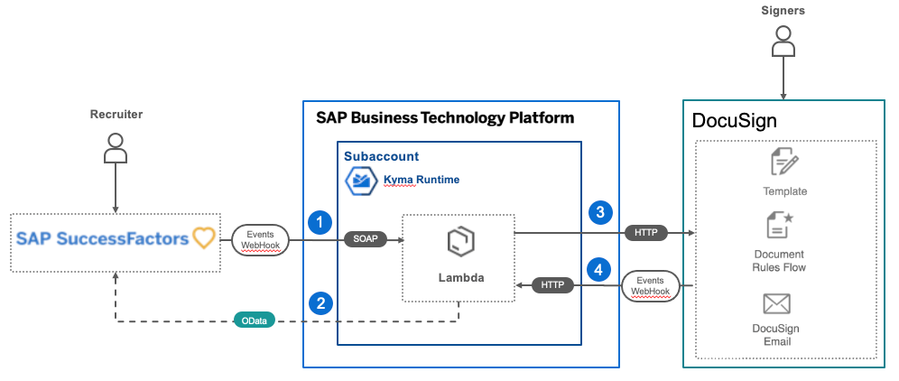

# SAP SuccessFactors Extension using DocuSign
Welcome to the SAP Business Technology Platform "SuccessFactors Extension", integrated with DocuSign
for signing electronically documents, use case PoC.

## Description

An extension to SAP SuccessFactors powered by event notifications,
integrated with DocuSign, electronically signed documents capabilities, that delivers a seamless and secure document full-fill
process from end to end.

Ensure secured compliance at different levels over hiring process, employment, and on any other updates,
like job title updated during employment for instance, having a safe and secure experience for the changes.

Required tenant for following systems:

- SAP SuccessFactors, [request](https://hxmcloudops.successfactors.com/home/index).
- [DocuSign](https://www.docusign.de/)

## Solution Architecture

## Guidelines
* [End to End Integration](./setup)

## Known Issues
No known issues at this moment.

## How to obtain support

[Create an issue](https://github.com/SAP-samples/cloud-extension-successfactors-docusign/issues) in this repository if you find
a bug or have questions about the content.

## Contributing
In case if you want to add some changes then your contributions will be welcome in the form of pull requests (PRs) -
please submit in the normal way. Thank you!

## License
Copyright (c) 2021 SAP SE or an SAP affiliate company. All rights reserved. This project is licensed under the
Apache Software License, version 2.0 except as noted otherwise in the [LICENSE](LICENSES/Apache-2.0.txt) file.
